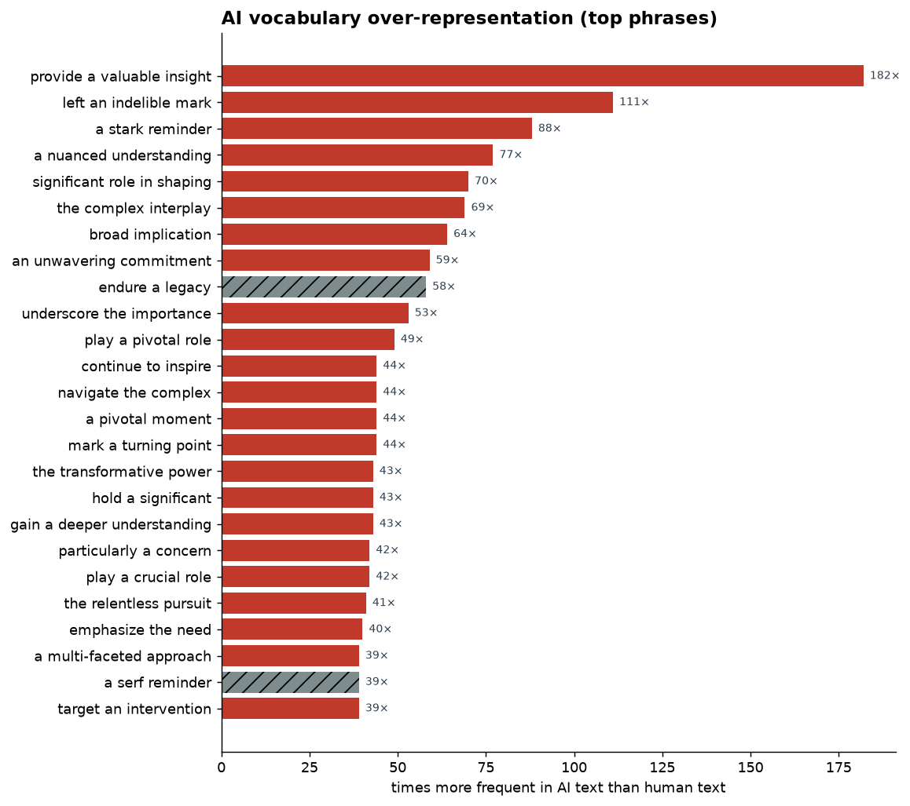
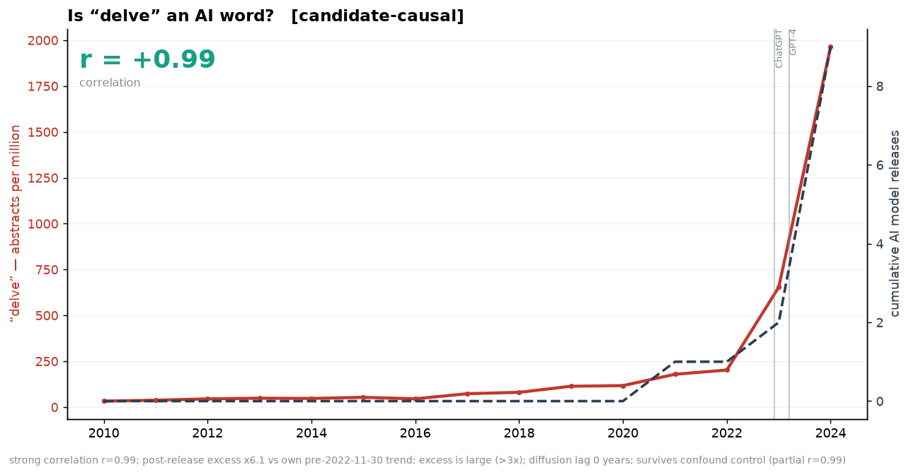
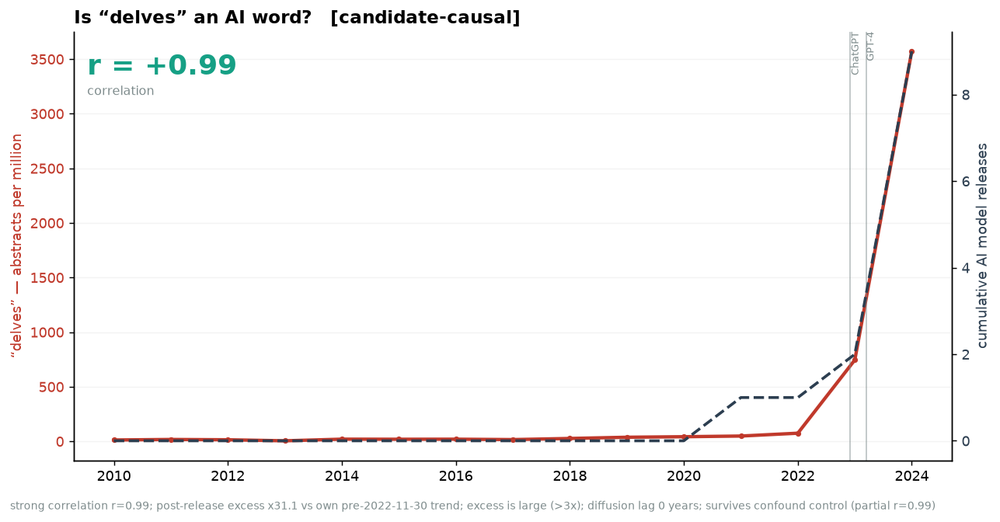
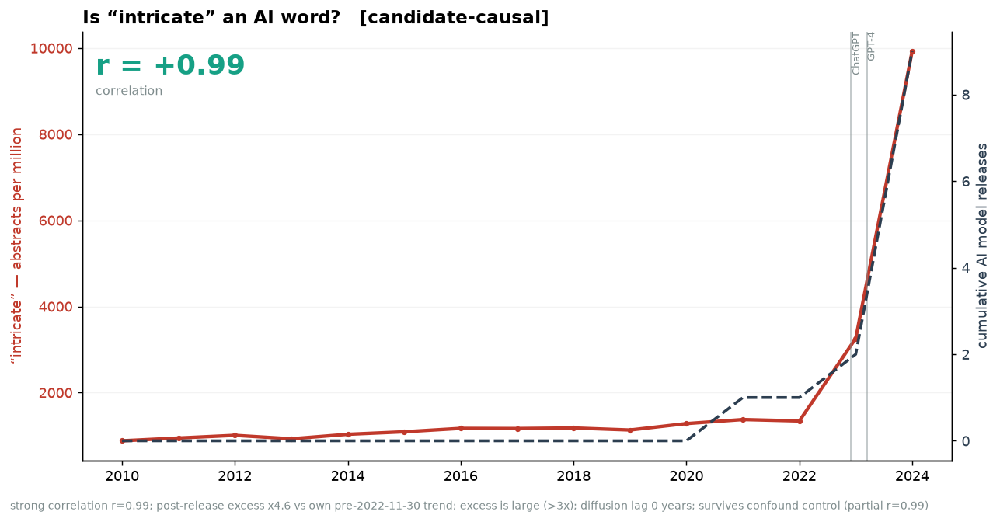
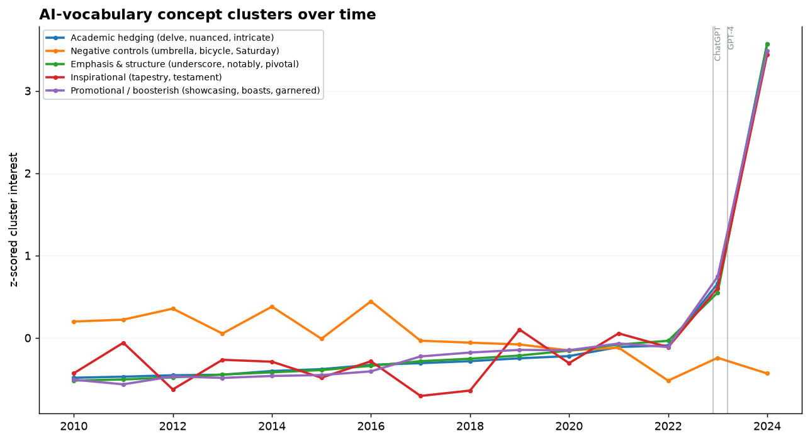

# Spurious Correlations in AI

*Finding — and stress-testing — correlations between AI model releases and the rise of
"AI-slop" vocabulary in human discourse.* In the spirit of
[tylervigen.com/spurious-correlations](https://tylervigen.com/spurious-correlations) for the
charts, and [gptzero.me/ai-vocabulary](https://gptzero.me/ai-vocabulary) for the
"N× more frequent in AI" framing — but with our own data and an explicit
spurious-vs-candidate-causal test.

_Last run: **2026-06-20** · 24 terms ·
20 `candidate-causal` · 20 flagged for review · updates weekly (Saturdays)._

> **Correlation is not causation.** This project is named *Spurious Correlations in AI* for a reason: most of what follows is, by construction, spurious. Two lines both sloping up since 2022 will always correlate. We label a term `candidate-causal` **only** when a big correlation is backed by a real *post-release break from the word's own prior trend* (interrupted time series) and survival of a confound control — and even then a human reviews it before we believe it.

## The over-representation leaderboard

The phrases LLMs overuse most, vs. humans (GPTZero top-100 snapshot + peer-reviewed corpora).
Hatched bars are suspected transcription errors held for review.

## Flagship correlations

### “delve” — candidate-causal (r = +0.99)

### “delves” — candidate-causal (r = +0.99)

### “intricate” — candidate-causal (r = +0.99)

## All tracked terms this run

| Term | Cluster | AI over-rep | r | level jump | lag (yr) | partial r | verdict | score |
|---|---|--:|--:|--:|--:|--:|---|--:|
| `delve` | academic-hedging | 30× | +0.99 | 6.1× | 0 | +0.99 | candidate-causal | 1.00 |
| `delves` | academic-hedging | — | +0.99 | 31.1× | 0 | +0.99 | candidate-causal | 1.00 |
| `intricate` | academic-hedging | — | +0.99 | 4.6× | 0 | +0.99 | candidate-causal | 1.00 |
| `intricacies` | academic-hedging | — | +0.99 | 4.3× | 0 | +0.99 | candidate-causal | 1.00 |
| `underscores` | emphasis-structure | — | +0.99 | 8.2× | 3 | +0.99 | candidate-causal | 1.00 |
| `underscore` | emphasis-structure | 53× | +0.99 | 4.4× | 0 | +0.99 | candidate-causal | 1.00 |
| `showcasing` | promotional | — | +0.99 | 5.5× | 0 | +0.99 | candidate-causal | 1.00 |
| `boasts` | promotional | — | +0.99 | 3.8× | 0 | +0.99 | candidate-causal | 1.00 |
| `groundbreaking` | promotional | — | +0.99 | 3.8× | 0 | +0.99 | candidate-causal | 1.00 |
| `realm` | promotional | — | +0.99 | 3.1× | 0 | +0.98 | candidate-causal | 1.00 |
| `commendable` | promotional | — | +0.99 | 4.5× | 0 | +0.99 | candidate-causal | 1.00 |
| `garnered` | promotional | — | +0.99 | 3.5× | 0 | +0.99 | candidate-causal | 1.00 |
| `saturday` | control | — | -0.52 | 0.9× | 3 | -0.05 | spurious | 1.00 |
| `bicycle` | control | — | -0.66 | 0.9× | 3 | -0.46 | spurious | 0.90 |
| `notably` | emphasis-structure | — | +0.98 | 1.9× | 0 | +0.97 | candidate-causal | 0.80 |
| `nuanced` | academic-hedging | 77× | +0.96 | 1.7× | 0 | +0.97 | candidate-causal | 0.80 |
| `meticulous` | promotional | — | +0.99 | 2.2× | 0 | +0.99 | candidate-causal | 0.80 |
| `pivotal` | emphasis-structure | 49× | +0.99 | 2.1× | 0 | +0.99 | candidate-causal | 0.80 |
| `crucial` | emphasis-structure | 42× | +0.97 | 1.8× | 0 | +0.97 | candidate-causal | 0.80 |
| `burgeoning` | promotional | — | +0.95 | 1.6× | 0 | +0.93 | candidate-causal | 0.80 |
| `testament` | inspirational | — | +0.94 | 2.2× | 0 | +0.92 | candidate-causal | 0.80 |
| `tapestry` | inspirational | — | +0.97 | 2.9× | 0 | +0.96 | candidate-causal | 0.80 |
| `umbrella` | control | — | +0.74 | 1.2× | 1 | +0.61 | spurious | 0.60 |
| `noteworthy` | promotional | 24× | +0.83 | 1.3× | 0 | +0.78 | spurious | 0.40 |

## Concept clusters

We group AI-favoured vocabulary into concepts so we can talk about *ideas* diffusing,
not just words. z-scored mean trajectory per cluster:

## Methodology (short version)

For each term we build its interest time-series and the cumulative model-release series,
then compute: Pearson/Spearman correlation, a single-breakpoint changepoint and its
alignment to releases, the best diffusion lag, and a **partial correlation** that removes
general AI-era drift (estimated from negative-control words). The verdict combines all of
these — see [METHODOLOGY.md](METHODOLOGY.md). Hypotheses tracked: diffusion lag, stylistic
markers, definition-seeking (Wiktionary), backlash inflection, cross-model synchrony.

## FAQ

**What is "AI vocabulary"?**
Words and turns of phrase that large language models produce far more often than
people do — "delve", "a nuanced understanding", "underscores the importance",
"a stark reminder". GPTZero calls its list "a kind of encyclopedia of AI language."

**What does the over-representation ratio mean?**
"182× more frequent in AI" means the phrase appears ~182 times as often in
AI-generated text as in comparable human text. Ratios here come from GPTZero's
published top-100 and from peer-reviewed corpora (Kobak et al. 2025; Liang et al. 2024),
not from us guessing.

**How do you decide a word is "AI-influenced" rather than just trending?**
A correlation alone proves nothing. We require: (1) a structural break in the word's
trajectory that lands *after* a model release, (2) the rise to lag the release (diffusion),
and (3) the correlation to survive a confound control that removes general "everything-AI-
went-up" drift. Words that pass are `candidate-causal` and still get human review.

**Why do you include obviously unrelated control words?**
Words like "umbrella" and "Saturday" are negative controls. They should show *no*
post-release signal. If a control ever lights up, our method is broken — and the
pipeline flags it for review.

**What data do you use?**
PubMed abstract word-frequencies (Kobak et al., yearly, real and reproducible),
plus — where reachable — Wikipedia & Wiktionary pageviews (daily), GDELT news volume,
and Hacker News mentions. Google Trends enters via manual CSV export. See METHODOLOGY.md.

**Is this the same as an AI detector?**
No. We are not scoring whether *your* text is AI-written. We track how AI-favoured
language is diffusing into human discourse over time.

## Data sources & provenance

This run used: **gdelt, google_trends_csv, hackernews, linkedin_manual, pubmed_kobak, wikipedia, wiktionary**.

Reference data: model-release timeline (`data/model_releases.yaml`), GPTZero top-100
(`data/gptzero_vocabulary.yaml`), Kobak et al. excess-vocabulary dataset.
The growing dictionary is versioned under `data/catalog/` (one JSON snapshot per run).

## Appendix — reverse-engineering GPTZero, and what this could sell for

GPTZero's AI-Vocabulary feature sits on top of a paid AI-detection business
(Free → Essential $15/mo → Premium $24/mo → Professional $35/mo; classroom/API tiers
on contract). The underlying vocabulary list is derived from ~3.3M texts comparing AI
vs human writing.

The AI-content-detection market was ~$1.08B in 2025 and is projected at ~$7.84B by 2035
(~26% CAGR). A *trend-data* product — "how AI is reshaping human language over time" —
is an under-served adjacency. Plausible B2B pricing for such a data/API offering:
$199–$500/mo (startup) → $1–5k/mo (mid) → $5–25k/mo (enterprise/SLA).

Cheapest credible comparable for sourcing the social signal: **Brand24 (~$199/mo)**,
which recently added by-model AI mention tracking. SerpApi / Glimpse / X-API were
evaluated and are **skip-for-now** — free Wikipedia/Wiktionary/GDELT/Hacker-News
proxies cover v1. This appendix is a documented backlog item, **not** a launch.

---
*Generated by the `spurcorr` pipeline. Reproduce with `python -m spurcorr.pipeline`.
Apache-2.0. Not affiliated with GPTZero or Tyler Vigen.*
